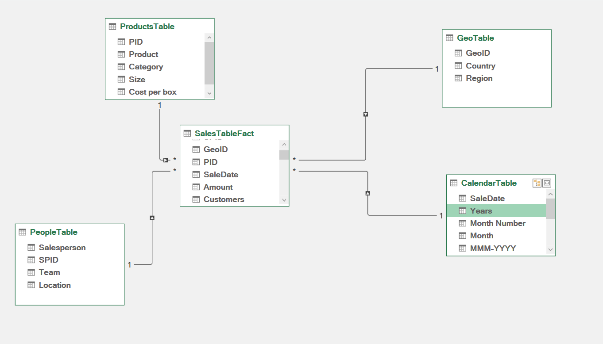
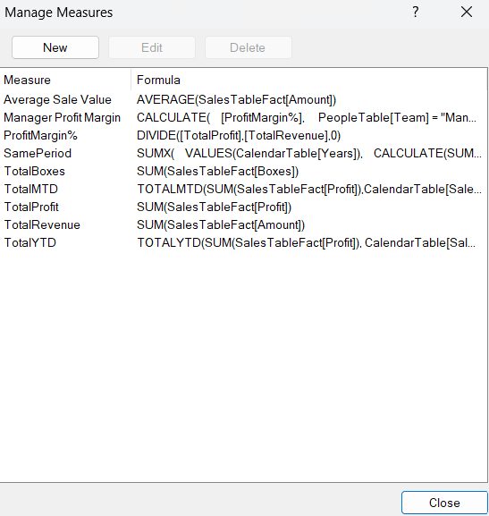
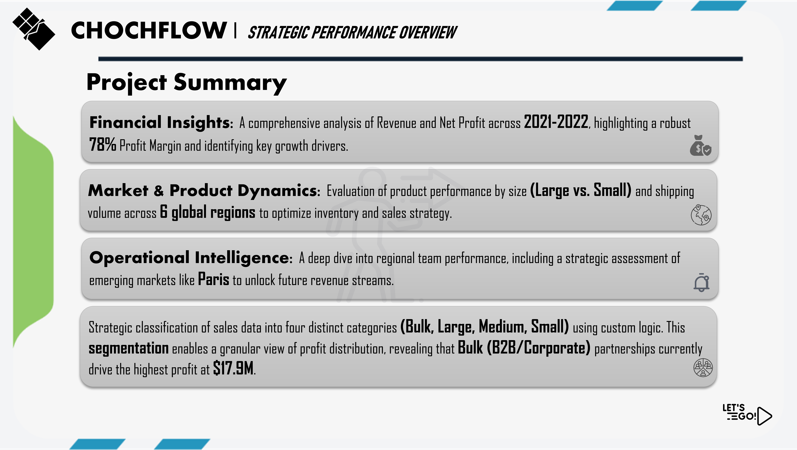
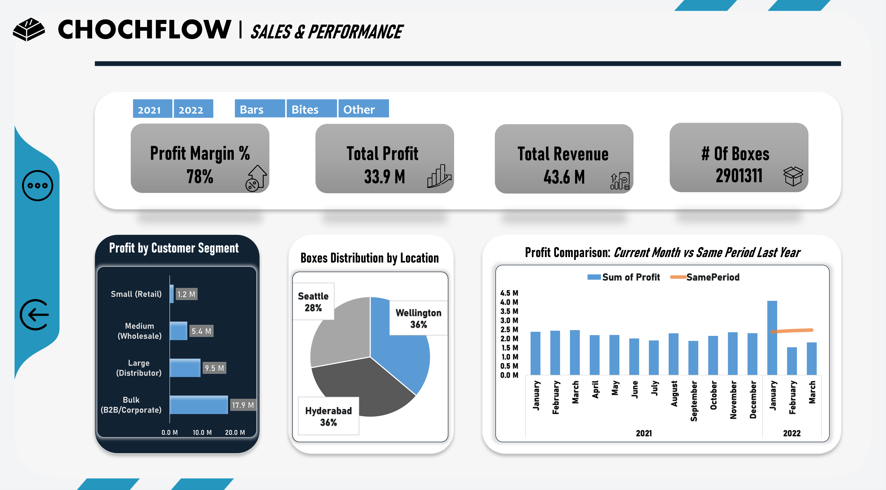
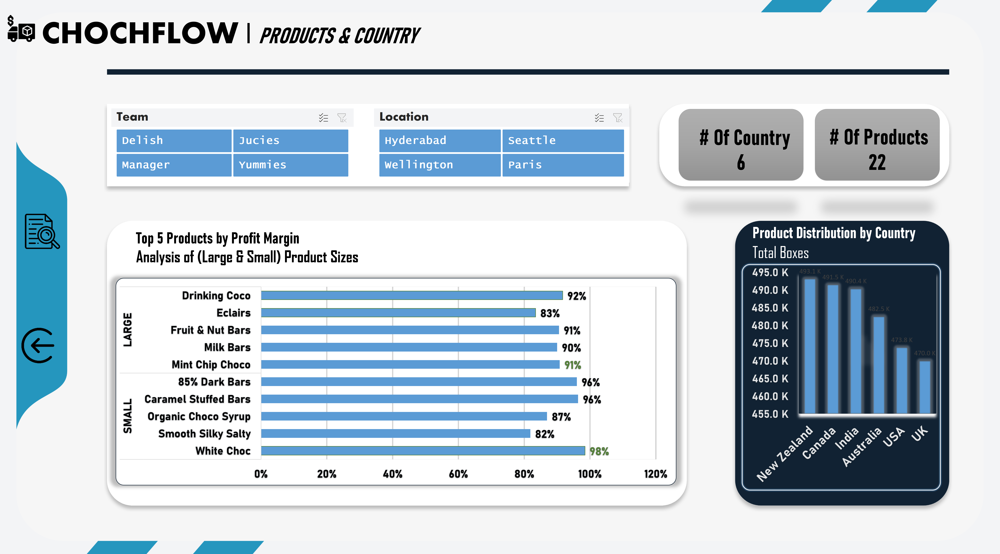

# 🍫 CHOCFLOW | Strategic Sales Intelligence Dashboard

## 📌 Project Overview
**CHOCFLOW** is a data-driven BI project analyzing global sales performance (2021-2022). The goal was to transform raw transactional data into a structured analytical model to track profitability, regional trends, and customer behavior.

---

## 🏗️ Data Engineering & Modeling
The project is built on a high-performance foundation using Excel Power Tools:

### 1. Data Cleaning (Power Query)
* **Handling NULLs:** Identified that **15% of the "Team" column** was missing. 
* **ETL Steps:** Data types were standardized, and profit margins were calculated at the row level for granular analysis.

### 2. Star Schema (Data Modeling)
Designed a robust **Star Schema** to enable efficient filtering and calculation:
* **Fact Table:** `SalesTableFact`
* **Dimension Tables:** `ProductsTable`, `GeoTable`, `PeopleTable`, and `CalendarTable`.
* **Relationships:** 1-to-many relationships established to ensure integrity across all dashboard slicers.

> 

---

## 🧪 Analytical Measures (DAX)
Implemented core financial KPIs using **Power Pivot (DAX)** to drive the dashboard:

* **Total Profit:** `SUM(SalesTableFact[Profit])`
* **Profit Margin %:** `DIVIDE([TotalProfit], [TotalRevenue])`
* **Year-Over-Year (SPLY):** `CALCULATE([TotalProfit], SAMEPERIODLASTYEAR('CalendarTable'[Date]))`

> 

---

## 💡 Key Business Insights
* **Team Performance:** By resolving the NULL values, "Management" was identified as a key sales driver, contributing significantly to the overall revenue.
* **Segmentation:** Used `SWITCH` logic to categorize orders by volume (Small, Medium, Large, Bulk), allowing for targeted B2B vs B2C analysis.
* **Geographic :** Analysis reveals that Paris currently has no recorded sales, despite having a dedicated team and manager assigned to the region. This has been identified as a high-potential target area for future expansion and strategic focus.

---

## 🖼️ Dashboard Preview

### 📊 Executive Overview

### 📈 Sales Performance

### 🌍 Geography & Products

---

## 📂 Repository Structure	
* `/Data`: Raw dataset.
* `/Dashboard`: The final `CHOCFLOW_Sales_Dashboard.xlsx` workbook.
* `/Images`: Technical screenshots (Schema, DAX, Power Query).

---